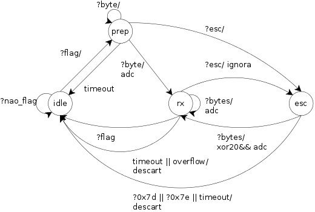
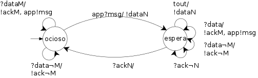
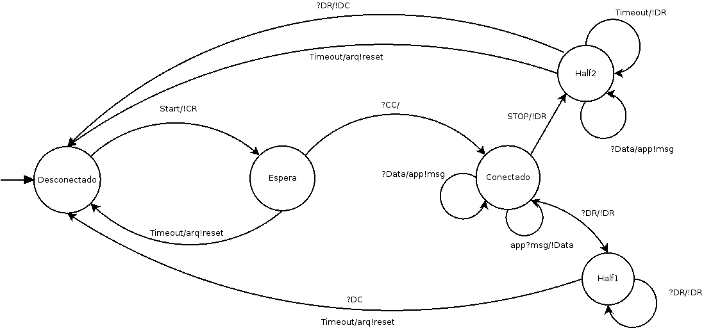
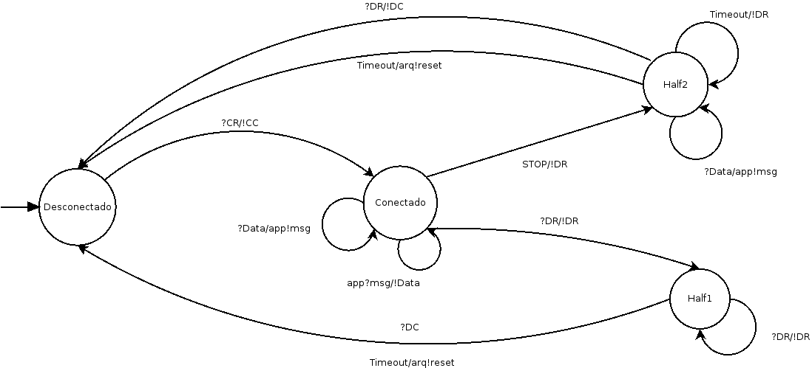
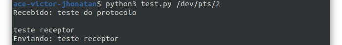
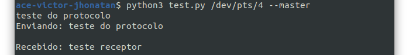

[](https://classroom.github.com/online_ide?assignment_repo_id=7891775&assignment_repo_type=AssignmentRepo)
# Projeto 2 - Protocolo de enlace
## Jhonatan Constantino e Victor Cesconetto
### Um protocolo de enlace ponto-a-ponto

## Descrição do PPP

Nosso projeto foi baseado no protocolo PPP (point-to-point protocol) que nada mais é que uma conexão direta entre dois nós. Ele pode fornecer autênticação de conexão, criptografia de transmissão e compressão.

É usado sobre muitos tipos de redes físicas incluindo cabo serial, linha telefônica, linha tronco, telefone celular, enlaces de rádio especializados e enlaces de fibra ótica como SONET. O PPP também é usado sobre conexões de acesso à Internet. Provedores de serviços de Internet têm usado o PPP para acesso discado à Internet pelos clientes, uma vez que pacotes IP não podem ser transmitidos sobre uma linha de modem por si próprios, sem algum protocolo de enlace de dados.

Há dois derivados do PPP, o Point-to-Point Protocol over Ethernet (PPPoE), em português protocolo ponto a ponto sobre Ethernet, e Point-to-Point Protocol over ATM (PPPoA), em português Protocolo ponto a ponto sobre ATM, que são usados mais comumente por Provedores de Serviços de Internet para estabelecer uma conexão de serviços de Internet de Linha Digital de Assinante (ou DSL) com seus clientes.

##  Projeto

Nosso protocolo se comunica através de um link utilizando portas seriais emuladas com o [Serialemu](https://github.com/IFSCEngtelecomPTC/Serialemu). O projeto se divide em algumas subcamadas como: enquadramento, arq, sessão, aplicação

### Enquadramento

É responsável por delimitar o quadro, utilizando a técnica do tipo sentinela com uma flag de valor 7E como delimitador do quadro, um byte de escape 7D para preenchimento de octeto. O transimissor faz o escape dos bytes 7E e 7D modificando por meio de um XOR 20. Podemos ver melhor o funcionamento através da máquina de estados a seguir:



### Arq

É uma família de mecanismos que têm como finalidade garantir a entrega de mensagens preservando a ordem de envio e buscando eficiência no uso do canal. Possibilitando que o transmissor se certifique de que uma mensagem foi entregue ou não ao destino. Enquanto uma mensagem não tiver sua entrega assegurada, ela permanece na fila de saída mantida no transmissor pelo protocolo. Tais mecanismos se baseiam em alguns elementos:

- Dois tipos de mensagens: dados e confirmação
- Mensagens de confirmação positiva (ACK) e opcionalmente, negativa (NAK)
- Mensagens são numeradas de acordo com uma sequência
- Retransmissão de mensagens perdidas ou recusadas

No projeto foi utilizado o mecanismo stop-and-wait, que tem seu desempenho dependente de seus parâmetros e de características físicas do enlace. Os quadros são considerados entregues somente quando o transmissor recebe uma confirmação do receptor. Podemos ver melhor o funcionamento através da máquina de estados a seguir:



### Sessão

A sessão é resposável por estabelecer, manter e terminar uma conexão. Como é um protocolo ponto-a-ponto, ele estabelecer um enlace entre as duas pontas participantes antes de poder transferir dados. Assim, evitando que as transmissões entre um par de participantes sejam confundidas com transmissões de outros pares.

Na criação de uma conexão, ambos os participantes devem sincronizar entre si para aceitar ou recusar a conexão e negociar parâmetros comuns operacionais do protocolo como por exemplo o tamanho máximo de PDU e identificador de conexão.

Na manutençao da conexão, é enviada mensagens de verificação periódicas para saber se o enlace está rompido ou ocioso para que não seja confundido um com o outro.

Na terminação da conexão, é preciso sincronismo entre os participantes para fechar a conexão e garantir que todas as mensagens de dados pendentes sejam entregues. Podemos ver melhor o funcionamento da sessão nas máquinas de estados a seguir:

Máquina de estado do iniciador de conexão


Máquina de estado do receptor de conexão


### Executando o projeto

Para fazê-lo executar basta seguir os passos abaixo:

- Clone o repositório do projeto e acesse o diretório:

```bash
$ git clone https://github.com/mmsobral-croom/projeto-2-um-protocolo-de-enlace-victor-jhonatan.git
$ cd projeto-2-um-protocolo-de-enlace-victor-jhonatan
```

- Execute o serialemu para emular as portas seriais que serão usadas:

```bash
$ ./Serialemu/serialemu -B 9600
```

- Instale o pyserial para rodar o projeto:

```bash
$ pip3 install pyserial
```

- Agora pode rodar o projeto com uma das portas seriais dada pelo serialemu como parâmetro no terminal 1:

```bash
$ python3 test.py [porta_serial_1]
```

- E no terminal 2 com a outra porta serial dada pelo serialemu e --master como parâmetros para indicar que será o iniciador da conexão:

```bash
$ python3 test.py [porta_serial_2] --master
```

O projeto então irá rodar e poderá testar o envio e recebimento de mensagens entre um terminal e o outro através das portas seriais dadas pelo serialemu, como podemos ver a seguir:




Para rodar com debug e verificar as etapas das subcamadas basta adicionar o parâmetro "--debug" como no exemplo:

```bash
$ python3 test.py [porta_serial_2] --master --debug

$ python3 test.py [porta_serial_1] --debug
```

Para definir o id da sessão basta adicionar o parâmetro "--idSessao número_id" como no exemplo:

```bash
$ python3 test.py [porta_serial_2] --master --debug --idSessao 32

$ python3 test.py [porta_serial_2] --master --idSessao 32

$ python3 test.py [porta_serial_1] --debug --idSessao 16

$ python3 test.py [porta_serial_1] --idSessao 8
```